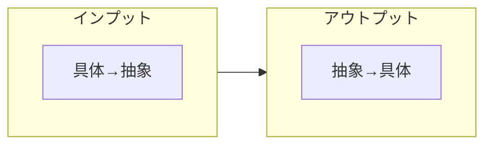
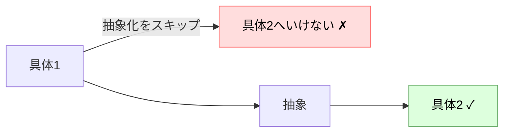
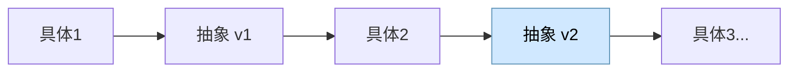
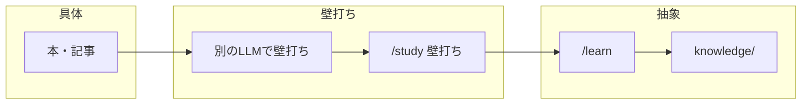
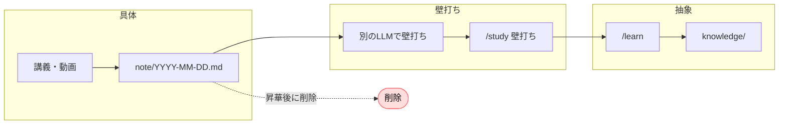

# 勉強の定義とフロー

## 前提となる思想

- どんなに複雑な物事も、**簡単なものの組み合わせ**でできている
- 基本が分かれば応用ができる
- どんな概念も**構造的なイメージ**を持つべき。文字で理解するのではなく、絵で、図で理解する

この思想が、以下のフレームワーク全体の土台になっている。
「抽象」とは構造的に把握した基本要素であり、それを持つことで応用（新しい具体）へ展開できる。

---

## 勉強とは何か

- インプットの方向：具体 → 抽象
- アウトプットの方向：抽象 → 具体
- **勉強するとは、抽象を積み上げ・洗練させ続けること**

### 抽象の定義
自分で整理した、最小限かつ汎用的な思考。
「これさえ覚えておけばいい」と言えるもの。コピーした定義ではなく、自分の言葉で蒸留したもの。

### なぜ習っても使えないか
具体1を学んだ段階で抽象化をスキップすると、抽象→具体2への展開ができない。

### 抽象は更新し続けるもの
具体1から作った抽象は仮説に過ぎない。具体2・3にぶつかることで精度が上がっていく。

knowledge/の概念ファイルを新規作成せず更新し続ける運用はこの考えに基づく。

---

## 使えるノートと使えないノート

**使えるノート**：見返すことのあるもの  

**使えないノート**：どんなに綺麗にまとめても見返すことのないもの

ノートの価値は「書くこと」ではなく「引き出せること」にある。

### 紙ノートの問題
- 探すのが大変（引き出す前に探すこと自体が手間）
- 保管場所が必要

### このプロジェクトの存在意義
上記の問題を解消するためにこのプロジェクトが存在する。
GitHubで管理しているのも、保管・検索・マルチデバイス運用を見据えた意図的な選択。

---

## 学習フロー

### 静的資料（本・記事）

見ながら /study できるため事前メモは不要。

### 動的資料（講義・動画）

動的資料はリアルタイムで流れるため、見ながら記録しないと整理が追いつかない可能性がある。
また、別タイミングに処理を持ち越したいときの一時置き場としても使う。
処理してknowledge/に昇華したら削除する。見返すための場所ではない。

---

## スキルとの対応

| フェーズ | スキル・場所 |
|---------|------------|
| 一時メモ（動的資料・持ち越し） | `note/YYYY-MM-DD.md` |
| 壁打ちで抽象化 | `/study` |
| knowledge/に蒸留・保存 | `/learn` |
| 概念の精錬（更新） | `knowledge/concepts/` を直接編集 |
| 復習・引き出し | `/recall` |
| 概念間の繋がり発見 | `/connect` |
