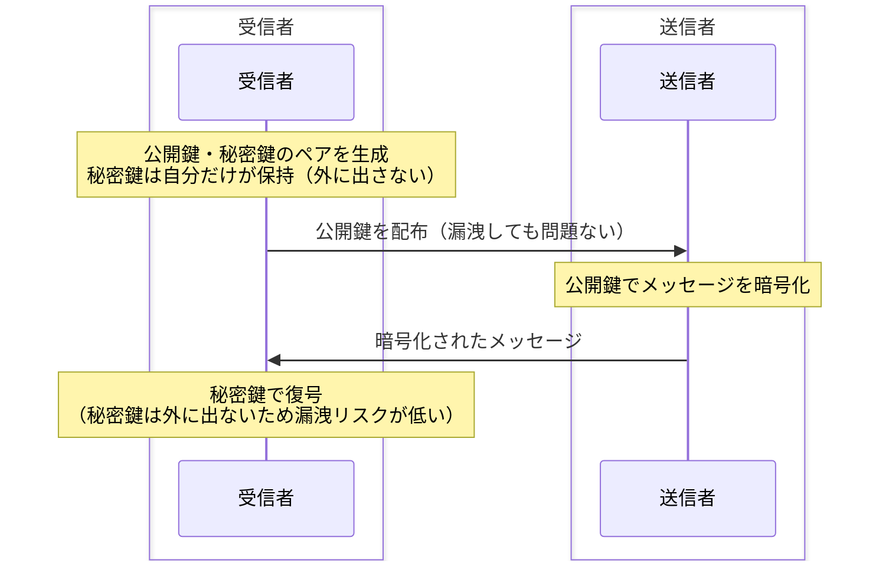
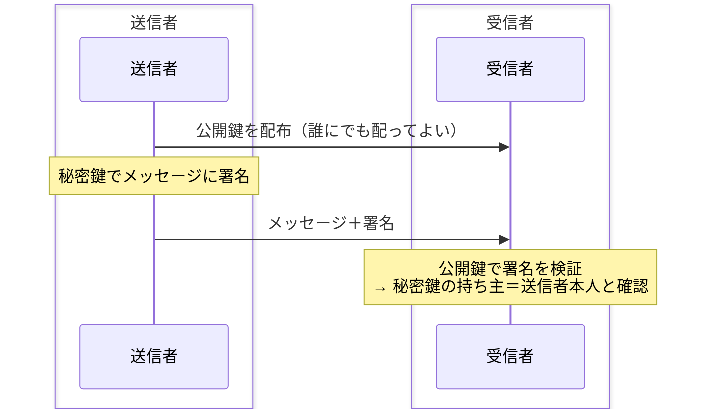

# Diagram Preview

## 公開鍵暗号方式のフロー

```mermaid
sequenceDiagram
    box 受信者
        participant R as 受信者
    end
    box 送信者
        participant S as 送信者
    end

    Note over R: 公開鍵・秘密鍵のペアを生成<br/>秘密鍵は自分だけが保持（外に出さない）
    R->>S: 公開鍵を配布（漏洩しても問題ない）
    Note over S: 公開鍵でメッセージを暗号化
    S->>R: 暗号化されたメッセージ
    Note over R: 秘密鍵で復号<br/>（秘密鍵は外に出ないため漏洩リスクが低い）
```

## デジタル署名のフロー

```mermaid
sequenceDiagram
    box 送信者
        participant S as 送信者
    end
    box 受信者
        participant R as 受信者
    end

    S->>R: 公開鍵を配布（誰にでも配ってよい）
    Note over S: 秘密鍵でメッセージに署名
    S->>R: メッセージ＋署名
    Note over R: 公開鍵で署名を検証<br/>→ 秘密鍵の持ち主＝送信者本人と確認
```
